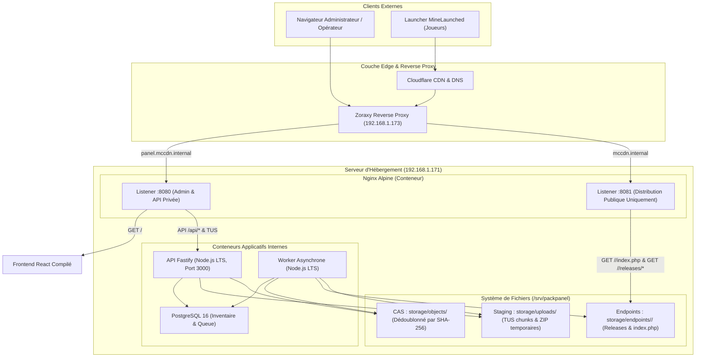
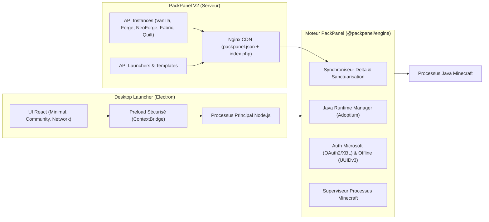

# Architecture Système & Technique - PackPanel

Ce document détaille l'architecture globale, la topologie des processus, les flux de données et les principes de conception de **PackPanel**.

La version actuelle utilise Node.js 24 et Fastify 5. Le launcher Electron
embarque sa configuration et son moteur, s’associe à une seule instance et
propose une interface FR/EN. Le parcours validé est offline ; voir le
[rapport de tests](TEST_REPORT.md) pour les versions effectivement lancées.

---

## 1. Topologie Globale des Composants

---

## 2. Étanchéité et Séparation des Listeners

PackPanel applique une séparation physique des écoutes réseau pour garantir une sécurité absolue :

1. **Port 8080 (Administration & API)** :
   - Reçoit le trafic destiné au domaine d'administration (`panel.mccdn.internal`).
   - Sert les fichiers statiques compilés de l'application React SPA.
   - Proxifie les requêtes `/api/` vers le conteneur Fastify interne.
   - Supporte les connexions Server-Sent Events (SSE) sur `/api/events` avec désactivation des tampons Nginx.
   - Gère les requêtes TUS chunked et téléversements directs sans mise en mémoire tampon.

2. **Port 8081 (Distribution Publique MineLaunched)** :
   - Reçoit exclusivement le trafic public destiné au domaine de téléchargement (`mccdn.internal`).
   - **Autonomie Totale** : Nginx lit directement l'arborescence `/srv/packpanel/storage/endpoints/` sur le disque hôte.
   - **Aucun accès API** : Toute requête vers `/api/` ou toute autre ressource retourne immédiatement un code HTTP 404. Même avec un en-tête `Host` falsifié, l'accès à l'API d'administration est impossible.
   - **Résilience** : Les joueurs peuvent continuer de télécharger les manifests et les mods même si PostgreSQL, l'API et le Worker sont arrêtés ou redémarrés.
   - **Anti-nettoyage intempestif** : Si un endpoint ou un fichier n'existe pas, Nginx retourne un code HTTP 404 strict. Aucun tableau JSON vide (`[]`) n'est jamais retourné pour un endpoint manquant, évitant ainsi que le launcher ne supprime les fichiers du client.

---

## 3. Stockage Adressé par le Contenu (CAS)

Le système de fichiers sous `/srv/packpanel` repose sur une architecture CAS (*Content-Addressed Storage*) :

### 3.1 Double Hachage en Flux Unique (*Dual-Stream Hashing*)
Lorsqu'un fichier est reçu, il est lu via un flux Node.js (`stream.Readable`) connecté simultanément à deux instances de calcul cryptographique :
- **SHA-256** : Sert d'identifiant universel et immuable dans le CAS (`/srv/packpanel/storage/objects/ab/cd/abcdef...`).
- **SHA-1** : Pré-calculé en minuscules sur 40 caractères pour satisfaire immédiatement le contrat MineLaunched sans recalcul ultérieur.

### 3.2 Déduplication et Liens Matériels (*Hardlinks*)
- Lorsqu'une version est assemblée, les fichiers de modpack ne sont pas copiés physiquement : PackPanel crée un lien matériel (*hardlink*) depuis l'objet CAS vers le répertoire de la release (`/srv/packpanel/storage/endpoints/<slug>/releases/<release_id>/<path>`).
- Deux versions partageant 95% des mêmes mods occupent exactement la même empreinte disque pour ces 95% de fichiers.
- Si le système de fichiers hôte ne supporte pas les hardlinks, une copie de secours est effectuée de manière transparente.

---

## 4. Contrat MineLaunched & Génération de Manifeste

Le manifeste public `/srv/packpanel/storage/endpoints/<slug>/index.php` est un document JSON UTF-8 pur généré à la publication de chaque version :
1. **Tri Déterministe** : Les dossiers parents apparaissent obligatoirement avant leurs sous-dossiers et leurs fichiers enfants.
2. **Entrées de Fichiers** :
   - `path` : chemin relatif standardisé sans antislash (ex: `mods/jei.jar`).
   - `checksumSHA1` : hash SHA-1 réel en 40 caractères hexadécimaux minuscules.
   - `url` : URL HTTPS absolue basée sur la variable configurée `FILES_FQDN`.
3. **Entrées de Répertoires** :
   - `path` et `url` terminés par `/`.
   - `checksumSHA1` fixé au booléen `false`.
4. **Directives de Nettoyage** :
   - Objets `{"dirCheckUselessFiles": "<dossier>"}` positionnés strictement à la fin du tableau JSON.
5. **Publication Atomique** : Le fichier est écrit dans `index.php.tmp`, synchronisé sur disque via `fsync()`, puis renommé de façon atomique vers `index.php`.

---

## 5. File de Tâches Asynchrone PostgreSQL

Plutôt que d'introduire une dépendance externe fragile comme Redis, PackPanel utilise une file de tâches transactionnelle et durable intégrée à PostgreSQL :
- **Atomicité et Parallélisme** : Les workers réservent les tâches via la clause `FOR UPDATE SKIP LOCKED`.
- **Mécanisme de Heartbeat** : Toutes les 30 secondes, le worker met à jour `heartbeat_at`. En cas de crash inattendu, une tâche bloquée depuis plus de 2 minutes est automatiquement libérée et ré-attribuée.
- **Retry Backoff** : Les échecs transitoires sont retentés avec un délai progressif jusqu'à `max_attempts`.

---

## 6. Architecture PackPanel V2 : Moteur Indépendant & Launchers

PackPanel V2 introduit un écosystème complet permettant de distribuer, synchroniser et exécuter des instances Minecraft avec son propre moteur et ses propres launchers de bureau.

### 6.1 Moteur Minecraft Indépendant (`@packpanel/engine`)
- **Indépendance Totale** : Strictement aucune dépendance à des SDKs ou moteurs tiers (ni EML, ni XMCL, ni minecraft-launcher-core, ni Helios, ni Prism).
- **Résolution Officielle** : Utilise le manifest Mojang piston-meta, les dépôts officiels Fabric Meta, Quilt Meta, Forge Maven et NeoForge Maven.
- **Gestionnaire Java** : Détecte l'environnement local ou télécharge de manière isolée le JRE Eclipse Temurin officiel via l'API Adoptium (Java 8, 17, 21).
- **Sanctuarisation des Données Joueurs** : Les sauvegardes solo (`saves/`), captures d'écran (`screenshots/`), configurations d'options (`options.txt`, `optionsof.txt`) et listes de serveurs (`servers.dat`) ne sont jamais écrasées ni supprimées lors des synchronisations de modpacks.

### 6.2 Sécurité Desktop Electron (`@packpanel/launcher`)
- `contextIsolation: true`, `nodeIntegration: false`, `sandbox: true`.
- Aucun accès direct depuis le renderer aux fichiers locaux, aux jetons ou aux processus enfants.
- Communication exclusive par bridge IPC typé (`window.packpanel`).

