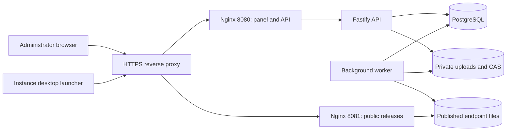

# Architecture

PackPanel is a Node.js 24 monorepo. Fastify 5 provides the API; React/Vite provides the bilingual administration panel. PostgreSQL 16 stores users, permissions, instances, release inventory and the background job queue. Nginx exposes two separate listeners.

The public listener serves static release files and manifests. It excludes the API, incoming uploads and hidden files. Published directories/files must be readable by unprivileged Nginx; upload and object storage remains private. The administrator listener serves the panel, authenticated API and server events.

## Publication

Uploads use direct multipart, resumable TUS or ZIP imports. The worker checks file sizes, hashes and safe paths, stores content-addressed objects and updates the inventory. Editing an instance creates draft configuration; publication captures the game configuration and file list in a release. Active manifest pointers are updated to the new release. Rollback restores an earlier release; promotion copies a release to a target endpoint and updates its public URLs.

Player launchers read the public `/<slug>/packpanel.json` manifest. Immutable files are located under `/<slug>/releases/<release-id>/`. Legacy `index.php` and `index.json` manifests remain available for compatibility. Caches must bypass active manifests while immutable release files may be cached.

## Desktop launcher

Each generated archive embeds Electron, the compiled engine and a configuration tied to one instance. The renderer is HTML/CSS/JavaScript with a custom title bar and French/English UI. Window controls and settings use restricted preload IPC. Players enter a nickname, click Play and manage RAM, JVM arguments, game files and logs in Settings.

The engine resolves official Mojang and loader metadata, installs the required Java runtime, verifies downloads, synchronizes the pack and starts Java. Player saves, screenshots and options are protected. The launcher runs without a separately installed Node.js or Java runtime. Current validated authentication is offline; the Microsoft module is a future integration scaffold. Legacy template names remain compatible configuration fields; they do not imply separate news or multi-instance interfaces in the current client.

## Packages

| Workspace | Purpose |
| --- | --- |
| `backend` | API, authentication, migrations, worker and launcher builds |
| `frontend` | FR/EN administration panel |
| `packages/protocol` | V2 schemas and shared types |
| `packages/engine` | Java, downloads, synchronization, loaders and game startup |
| `packages/launcher` | Electron process, preload and instance renderer |
| `packages/sdk` | API and engine helpers |
| `packages/templates` | Legacy template configuration helpers |

Docker builds every workspace from the root lockfile. Production data is outside the source checkout. See [operations](OPERATIONS.md), [API reference](API_SDK_REFERENCE.md) and [validation scope](TEST_REPORT.md).
