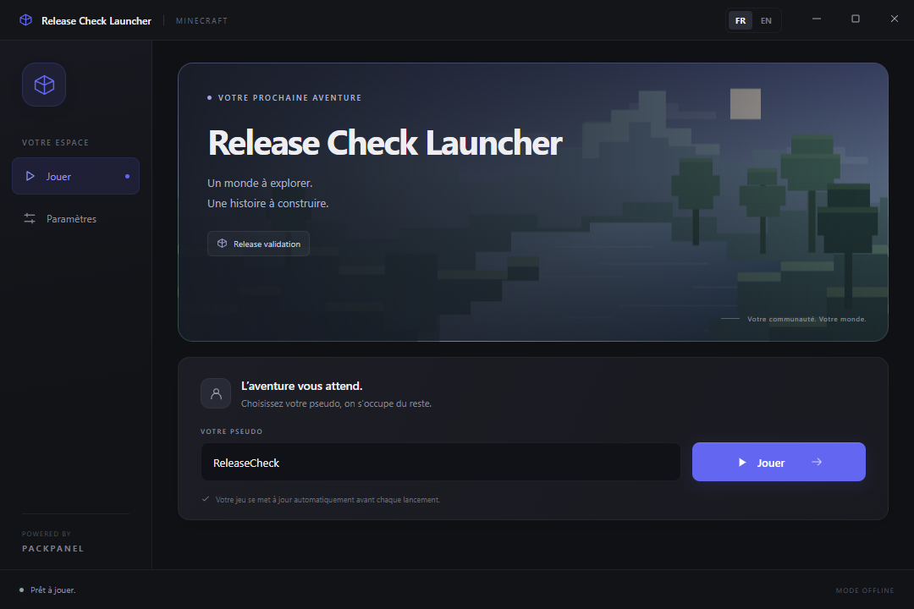
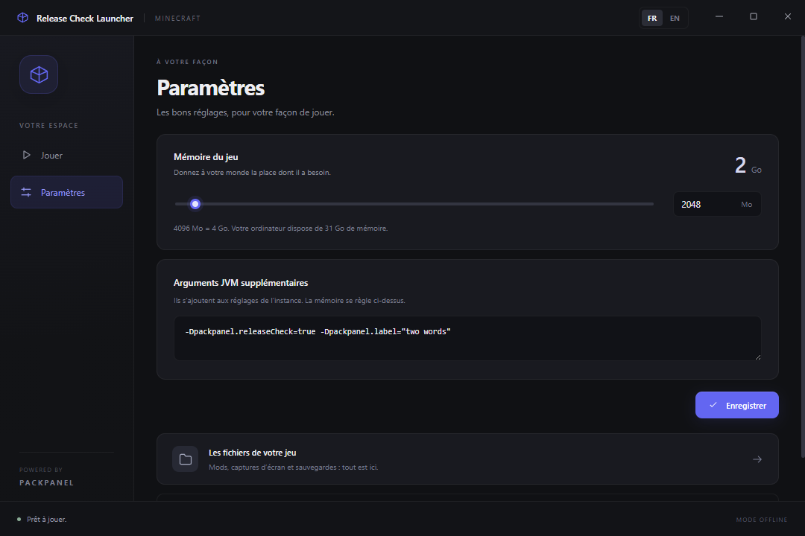

# Déploiement et validation — 4 octobre 2026

La version corrigée est déployée sur **192.168.1.171**. L’application compilée
correspond au commit `f1a6f49921d7bf0b7246807faa3b6febe38a5ffb` de la branche
`feature/v3-instance-centric-launcher`. Les mises à jour suivantes de ce rapport,
des captures et des scripts de vérification ne changent pas l’application.

## Production

- Application : `/opt/packpanel` ; données : `/srv/packpanel`.
- Panel/API : `http://192.168.1.171:8080/`.
- Distribution d’origine : port 8081 ; CDN public : `https://mccdn.inferi.fr`.
- Services : API et worker Node.js 24, panel/Nginx compilé, PostgreSQL 16.
- Migrations appliquées avant démarrage. `/api/health` vérifie aussi la base
  et retourne `status: ok`, version `2.0.0`.
- Les quatre services sont actifs ; PostgreSQL est healthy ; API et worker
  n’ont pas subi de redémarrage automatique pendant la validation.

Les comptes et endpoints préexistants sont conservés. Aucun mot de passe
ni jeton de validation n’est consigné dans le dépôt.

## Sauvegarde et retour arrière

Avant la mise à jour, la distribution et la base ont été sauvegardées dans :

`/srv/packpanel/backups/pre-release-20261004/packpanel_backup_20261004_171126.tar.gz`

Le même répertoire privé contient `source.tar.gz`, le commit précédent et
le journal du déploiement. Les anciennes images sont conservées sous
`packpanel-pre-release-api:20261004`, `packpanel-pre-release-worker:20261004`
et `packpanel-pre-release-nginx:20261004`. Le script de déploiement a également
réalisé sa sauvegarde avant migration.

Une sauvegarde/restauration complète a été réellement exécutée dans le
déploiement isolé, avec une base et un stockage distincts. La production
n’a pas été restaurée pendant cet essai.

## Vérifications effectuées

Les quatre smoke checks HTTP passent après mise à jour et après nettoyage.
Les essais API en production couvrent création et changements de modloader,
Java compatible, uploads directs/TUS/ZIP, exécution du worker, publication,
manifestes publics et téléchargement des fichiers par le CDN HTTPS.

L’ancienne base ne possédait pas l’unicité `(session_id, relative_path)` requise
pour les uploads. La migration la crée désormais sur une installation existante.
Cette réparation a été testée en retirant cette contrainte de la base isolée,
puis en appliquant deux fois la migration. Les uploads en production passent.

Le bouton **Télécharger** de la page d’une instance a fourni le ZIP Windows
attendu ; son SHA-256 correspond à celui du build. Ce même ZIP a été ouvert
sur Windows et utilisé pour un premier démarrage, une mise à jour publiée,
puis un second démarrage. RAM et arguments JVM sont transmis au vrai processus
Java ; les sauvegardes personnelles sont conservées et les fichiers obsolètes
du dossier mods sont nettoyés.

Minecraft 1.21.1 a ensuite atteint l’initialisation graphique/audio avec
**Vanilla, Fabric 0.19.5, Forge 52.1.0, NeoForge 21.1.255 et Quilt 0.24.0**.
Les refus de modification/publication pour lecteurs et opérateurs sans droits
ont été testés en production ; les comptes de test ont été supprimés.
Rollback et promotion avec téléchargement des fichiers cibles ont été testés
dans le déploiement isolé.

Le launcher présente une seule instance, un pseudo et Jouer, puis un onglet
Paramètres pour RAM, arguments, fichiers et journal. Sa barre de titre
personnalisée et ses boutons réduire/agrandir/restaurer/fermer fonctionnent.
L’interface français/anglais et la mémorisation de la langue ont été vérifiées.

Les instances et builds jetables de production ont été supprimés, leurs
distributions retirées et la session de validation révoquée. Le déploiement
isolé sur 18080/18081 a été arrêté.

## Périmètre de release

La validation concerne **Windows x64 en mode offline**, sur Minecraft 1.21.1
pour les démarrages réels. Les 67 tests automatisés passent, la compilation
complète réussit et npm audit ne rapporte aucune vulnérabilité connue au moment
de la vérification. Microsoft sera intégré ultérieurement, selon la demande.
Les clients Linux/macOS et toutes les versions historiques de Minecraft ne
sont pas couverts par une preuve de démarrage sur leurs plateformes respectives.
